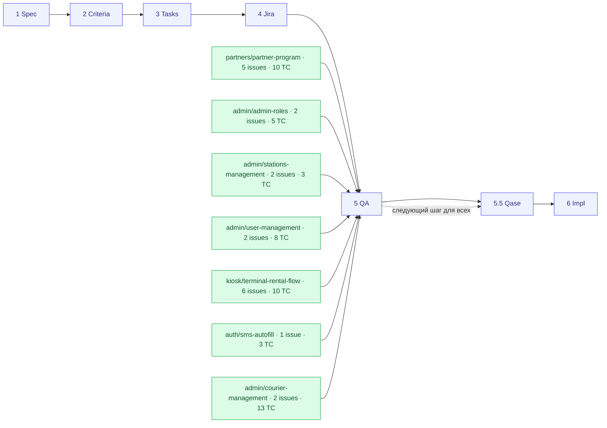

# System Map — gozap-documentation

Живая карта всех фич и их положения в конвейере поставки. **Эта таблица — канонический
источник**; Mermaid-схема ниже строится из неё.

Конвейер этапов: `1 Spec → 2 Criteria → 3 Tasks → 4 Jira → 5 QA → (5.5 Qase) → 6 Impl`

**Легенда статуса:** 🟩 `done` (этап пройден) · 🟨 `in-progress` · ⬜ `planned` / нет артефакта · 🟥 `blocked`

**Tally:** фич всего 7 · доведено до Jira 7 · с QA test cases 7 · в Qase sync 0 · в реализации 0

---

## Реестр фич (канонично)

| Домен | Фича | 1 Spec | 2 Criteria | 3 Tasks | 4 Jira | 5 QA | 6 Impl | Текущий этап | Заметки |
|---|---|:---:|:---:|:---:|:---:|:---:|:---:|---|---|
| partners | partner-program | 🟩 | 🟩 | 🟩 | 🟩 | 🟩 | ⬜ | **QA-ready** | 5 Jira-issue (BE: аккаунты/станции/баланс, Stripe payouts, Twilio password reset; FE: admin-раздел, partner dashboard). 10 test cases, 2 partial (Stripe-продукт, KYC не подтверждены). Видимость раздела регулируется `admin/admin-roles`. Ждёт Qase sync. |
| admin | admin-roles | 🟩 | 🟩 | 🟩 | 🟩 | 🟩 | ⬜ | **QA-ready** | 2 Jira-issue (BE RBAC, FE создание администратора + навигация). 5 test cases, 1 partial (код ответа при недоступном разделе не подтверждён). Модель доступа — явный множественный выбор разделов (Станции, Пользователи, Партнёры). Ждёт Qase sync. |
| admin | stations-management | 🟩 | 🟩 | 🟩 | 🟩 | 🟩 | ⬜ | **QA-ready** | 2 Jira-issue (BE CRUD станции, FE раздел «Станции»). 3 test cases. Набор полей станции не зафиксирован (open question). Ждёт Qase sync. |
| admin | user-management | 🟩 | 🟩 | 🟩 | 🟩 | 🟩 | ⬜ | **QA-ready** | 2 Jira-issue (BE CRUD/промо/блокировка/карточка, FE раздел «Пользователи»). 8 test cases. Эффект промоаккаунта и поведение блокировки при активной аренде не зафиксированы (open questions). Ждёт Qase sync. |
| admin | courier-management | 🟩 | 🟩 | 🟩 | 🟩 | 🟩 | ⬜ | **QA-ready** | 2 Jira-issue (BE учётки курьеров/станции/ПБ-операции, FE интерфейс курьера + управление курьерами супер-админом). 13 test cases, 1 partial (набор полей учётной записи курьера не зафиксирован). Ждёт Qase sync. |
| kiosk | terminal-rental-flow | 🟩 | 🟩 | 🟩 | 🟩 | 🟩 | ⬜ | **QA-ready** | 6 Jira-issue (BE: подтверждение номера, оплата/выдача, синхронизация с `gozap-app` и уведомления, упрощённый flow; FE: основной flow, упрощённый flow). 10 test cases, 2 partial (платёжный провайдер терминала не подтверждён). Ждёт Qase sync. |
| auth | sms-autofill | 🟩 | 🟩 | 🟩 | 🟩 | 🟩 | ⬜ | **QA-ready** | 1 Jira-issue (FE автоподстановка кода). 3 test cases, 2 partial (механизм автоподстановки и авто-сабмит не подтверждены). Полностью зависит от backend-контракта `terminal-rental-flow`. |

> Колонка «этап» = самый дальний пройденный этап. Следующий шаг для всех фич — **этап 5.5 (Qase sync)**, затем **этап 6 (Impl)** в целевых репозиториях.

---

## Карта (генерируется из таблицы)

---

## Как обновлять

1. Закрыл этап для фичи — поменяй её ячейку в таблице (⬜ → 🟩) и колонку «Текущий этап».
2. Обнови **Tally** вверху.
3. Если добавилась новая фича — добавь строку и узел в Mermaid (`:::done` / `:::planned`).
4. Зафиксируй изменение в [PROGRESS.md](./PROGRESS.md) (update log).

Владелец карты: кто ведёт фичу через конвейер (SA / Team Lead).
