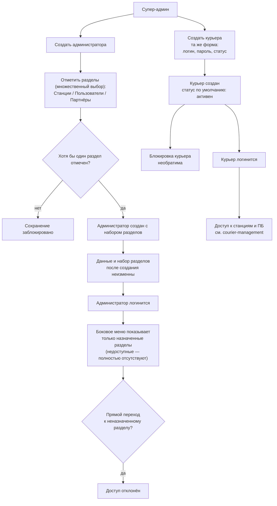
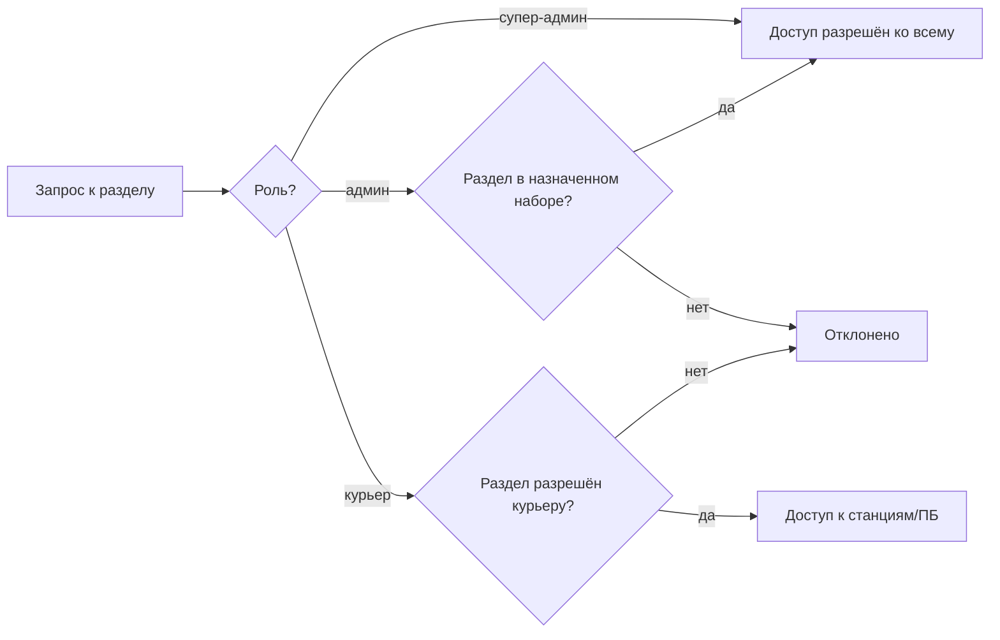
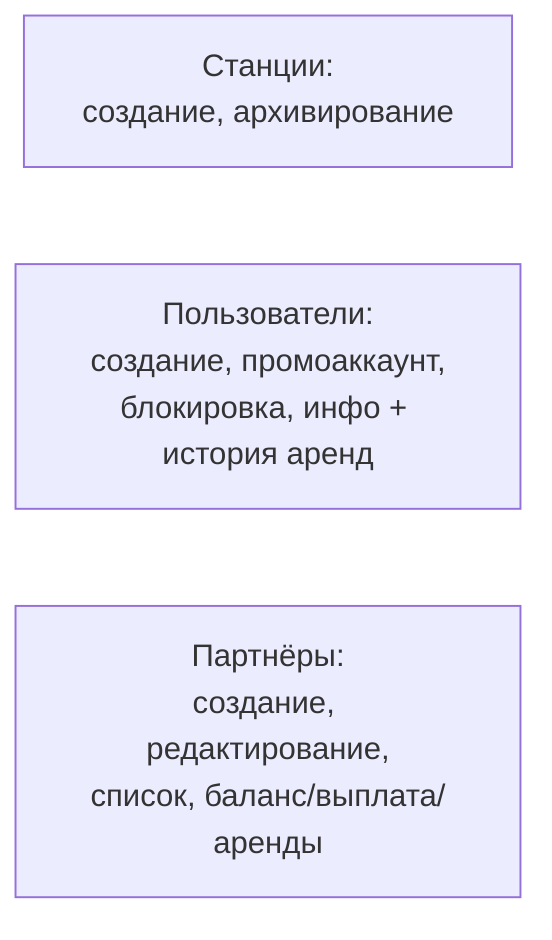

## Роли в админке — визуальный TL;DR

Источник: [../requirements/feature-spec.md](../requirements/feature-spec.md). Схема — краткая суть, детали в спеке.

### User flow (что видит пользователь)

### Что внутри (pipeline)

### Список разделов

> Этап в конвейере: **Jira-ready** (2 issues) → **QA test cases** готовы. См. [../../../PROGRESS.md](../../../PROGRESS.md).
>
> Вне итерации: гранулярные права внутри раздела, аудит-лог, делегирование роли супер-админа, редактирование данных/набора разделов администратора после создания. CRUD-логика разделов — в `admin/stations-management`, `admin/user-management`, `partners/partner-program`. Детальная функциональность курьера — в `admin/courier-management`.
