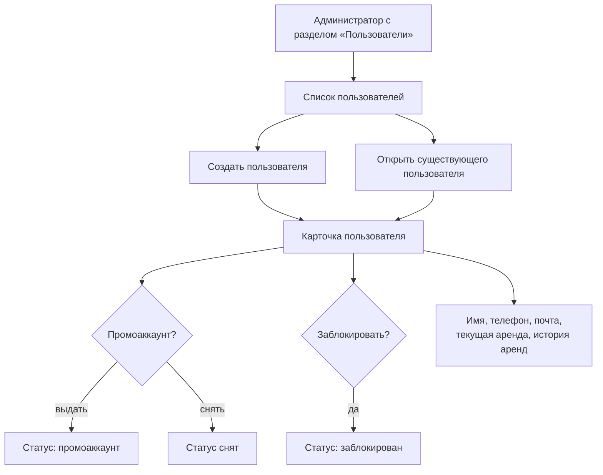
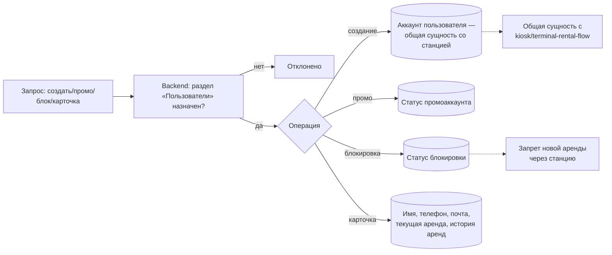

## Управление пользователями в админке — визуальный TL;DR

Источник: [../requirements/feature-spec.md](../requirements/feature-spec.md). Схема — краткая суть, детали в спеке.

### User flow (что видит пользователь)

### Что внутри (pipeline)

> Этап в конвейере: **Jira-ready** (2 issues) → **QA test cases** готовы. См. [../../../PROGRESS.md](../../../PROGRESS.md).
>
> Вне итерации: редактирование данных пользователя, удаление пользователя, разблокировка (см. open questions).
