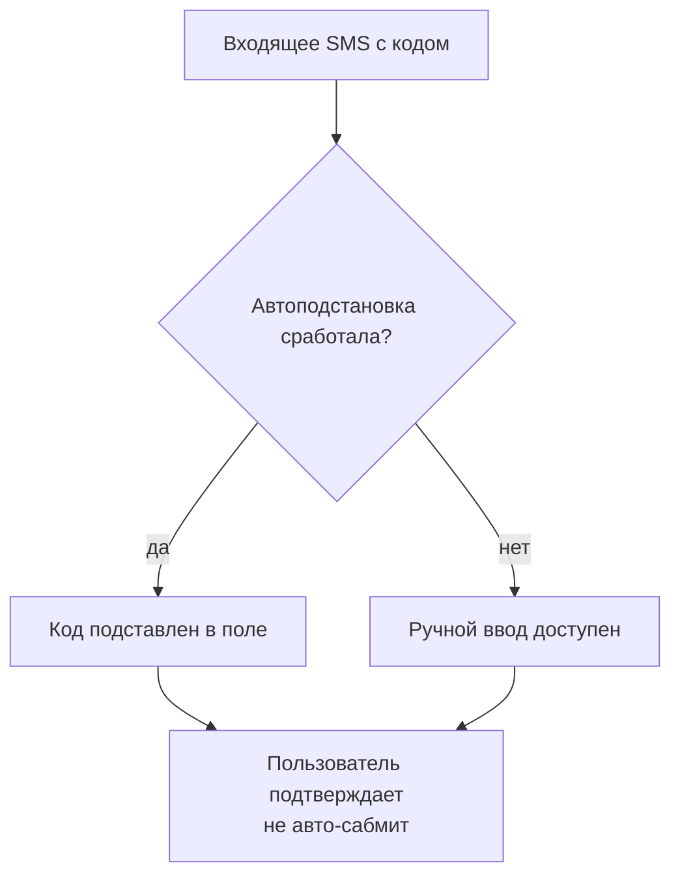
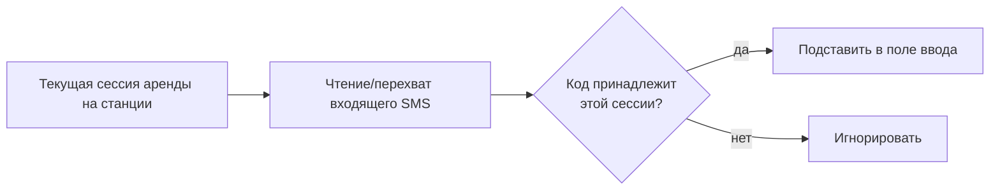

## Автоподстановка SMS-кода — визуальный TL;DR

Источник: [../requirements/feature-spec.md](../requirements/feature-spec.md). Схема — краткая суть, детали в спеке.

### User flow (что видит пользователь)

### Что внутри (pipeline)

> Этап в конвейере: **Jira-ready** (1 issue) → **QA test cases** готовы. См. [../../../PROGRESS.md](../../../PROGRESS.md).
>
> Вне итерации: backend-логика отправки/проверки кода (см. `terminal-rental-flow`), автоподстановка на других поверхностях. Технический механизм автоподстановки на станции не подтверждён.
